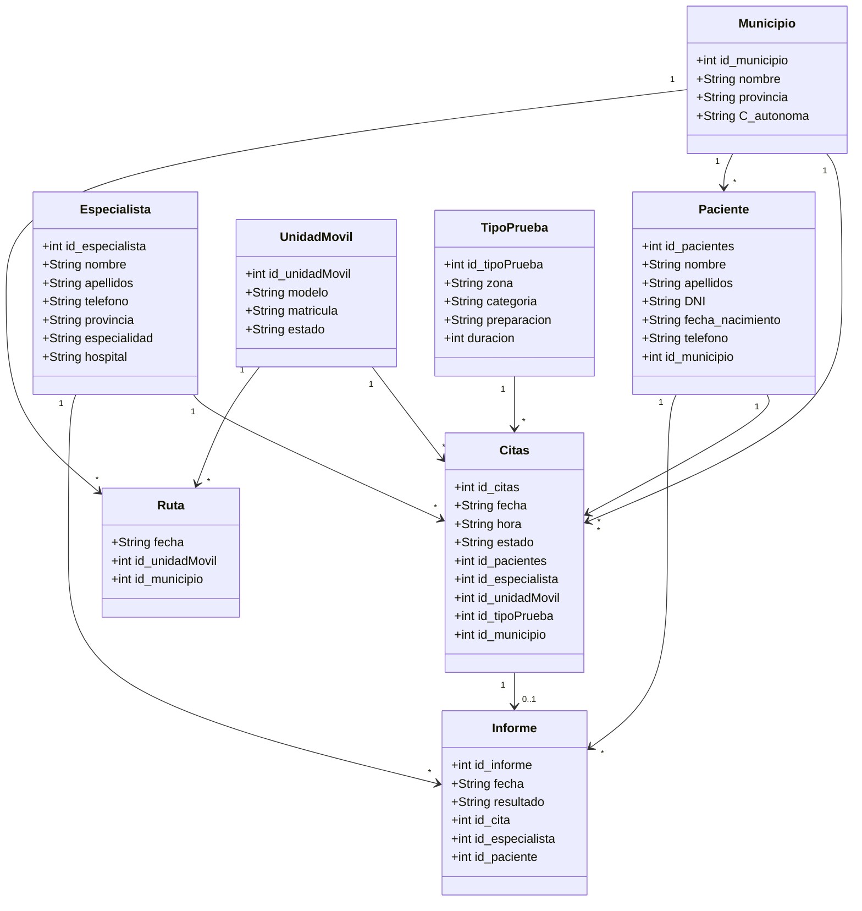

# UDR - Unidad Diagnóstica Rural

## ¿Qué es UDR?
UDR es una empresa de servicio móvil de resonancia magnética diseñada para acercar la tecnología diagnóstica de alta resolución a poblaciones rurales que carecen de acceso a este tipo de pruebas médicas.

## ¿Qué problema resuelve?
Más de 8.000 municipios españoles, la mayoría con menos de 5.000 habitantes, no tienen acceso cercano a una resonancia magnética. Los pacientes rurales deben recorrer decenas de kilómetros y esperar meses para realizarse una prueba básica. UDR lleva la unidad móvil hasta el municipio del paciente, integrándose en el circuito de la sanidad pública sin cambiar los procedimientos habituales.

## Tecnologías utilizadas
- HTML5
- CSS3 (Flexbox, Grid, variables CSS, media queries)
- Google Fonts (Bree Serif, Roboto)
- Java (próximamente)
- MySQL 

## Módulos del proyecto
- /bases_de_datos — Bases de Datos 
- /lenguajes_marcas — Lenguajes de Marcas 
- /programacion — Programación  y MPO
- /sistemas — Sistemas Informáticos 

## Base de datos
La base de datos modela el funcionamiento interno de UDR. Gestiona la información de pacientes, especialistas, unidades móviles, municipios, citas, tipos de prueba e informes.

Las tablas principales son:
- **pacientes** — personas que solicitan una prueba diagnóstica
- **especialista** — médicos que solicitan y redactan los informes
- **unidadMovil** — vehículos equipados con resonancia magnética
- **municipio** — poblaciones rurales donde se desplaza la unidad
- **citas** — reservas que conectan paciente, especialista, unidad y municipio
- **tipoPrueba** — tipos de resonancia disponibles por categoría y zona
- **informe** — resultado de cada prueba vinculado a la cita y al paciente
- **ruta** — tabla intermedia que registra qué unidad va a qué municipio y cuándo

## Instrucciones de ejecución
1. Clona o descarga el repositorio
2. Abre el archivo `lenguajes_marcas/index.html` con cualquier navegador web
3. Navega por las páginas desde el menú de navegación
No requiere instalación ni servidor.

## Aplicación Java (Módulo de Programación)
### ¿Qué hace?
Aplicación de consola en Java que gestiona los datos internos de UDR mediante conexión directa a la base de datos MySQL. Permite realizar operaciones CRUD sobre todas las entidades del sistema.
### Requisitos previos
- Java 17 o superior
- IntelliJ IDEA (u otro IDE Java)
- XAMPP con MySQL activo
- MySQL Workbench (opcional, para visualizar los datos)
### Cómo ejecutarla
1. Clona el repositorio
2. Abre XAMPP y arranca el servicio **MySQL**
3. En MySQL Workbench (o phpMyAdmin), ejecuta en orden:
   - `bases_de_datos/sql/crearTablas.sql`
   - `bases_de_datos/sql/datos.sql`
4. Abre la carpeta `programacion/` como proyecto en IntelliJ
5. Ejecuta la clase `Main.java`
### Funcionalidades
- **Gestión de citas**
  - Ver todas las citas
  - Ver citas pendientes
  - Crear cita de resonancia (con validación de paciente y unidad disponible)
  - Cancelar cita
- **Gestión de municipios**
  - Ver todos los municipios
- **Gestión de rutas**
  - Ver todas las rutas
  - Ver rutas programadas para hoy
- **Gestión de unidades móviles**
  - Ver todas las unidades móviles
  - Ver unidades móviles activas
- **Gestión de especialistas**
  - Ver todos los especialistas
  - Buscar especialistas por especialidad
- **Tipos de prueba**
  - Ver todos los tipos de prueba
  - Buscar prueba por categoría
- **Gestión de informes**
  - Ver todos los informes
  - Registrar nuevo informe
- **Gestión de pacientes**
  - Ver todos los pacientes
  - Buscar paciente por DNI
  - Registrar nuevo paciente
  - Actualizar teléfono
  - Eliminar paciente
### Entidades gestionadas
Paciente, Especialista, UnidadMovil, Municipio, Citas, TipoPrueba, Informe, Ruta
### Conexión con la base de datos
Toda la comunicación con MySQL se realiza mediante JDBC a través de la clase `Conexion.java` (paquete `db`). Cada entidad tiene su propio DAO que ejecuta las consultas SQL.
---
## Arquitectura del proyecto Java (MPO)
El proyecto sigue una arquitectura en capas:
model/ → Clases Java que representan las entidades (POO, encapsulación)
db/ → Conexión JDBC a MySQL (patrón Singleton)
dao/ → Acceso a datos, consultas SQL (CRUD)
controller/ → Lógica de interacción con el usuario
Main.java → Menú principal, punto de entrada

### Mejora MPO
1. **Rutas de hoy** — filtra en tiempo real las rutas programadas para la fecha actual
2. **Creación de cita con validación** — antes de crear una cita, el sistema verifica 
   que existe el paciente y que hay unidades móviles activas. Si alguna condición 
   no se cumple, la operación se cancela con un mensaje claro.



## Estructura del repositorio

```text
UDR-Diagnostica-Rural/
├── bases_de_datos/
│   ├── diagramas/
│   │   ├── Diagrama_UDR.drawio
│   │   ├── Diagrama_UDR.png
│   │   ├── Diagrama_UDR_relacional.drawio
│   │   └── Diagrama_UDR_relacional.png
│   └── sql/
│       ├── crearTablas.sql
│       ├── datos.sql
│       └── consultas.sql
├── lenguajes_marcas/
│   ├── index.html
│   ├── Servicios.html
│   ├── SobreUDR.html
│   ├── Cobertura.html
│   ├── Contacto.html
│   ├── style.css
│   ├── Imágenes/
│   └── Videos/
├── programacion/   ← cubre Programación y MPO (mismo proyecto Java)
│   └── UDR/
│       └── src/
│           └── main/
│               └── java/
│                   └── com/udr/
│                       ├── model/
│                       │   ├── Citas.java
│                       │   ├── Especialista.java
│                       │   ├── Informe.java
│                       │   ├── Municipio.java
│                       │   ├── Paciente.java
│                       │   ├── Ruta.java
│                       │   ├── TipoPrueba.java
│                       │   └── UnidadMovil.java
│                       ├── db/
│                       │   └── Conexion.java
│                       ├── dao/
│                       │   ├── CitasDAO.java
│                       │   ├── EspecialistaDAO.java
│                       │   ├── InformeDAO.java
│                       │   ├── MunicipioDAO.java
│                       │   ├── PacienteDAO.java
│                       │   ├── RutaDAO.java
│                       │   ├── TipoPruebaDAO.java
│                       │   └── UnidadMovilDAO.java
│                       ├── controller/
│                       │   ├── CitasController.java
│                       │   ├── EspecialistaController.java
│                       │   ├── InformeController.java
│                       │   ├── MunicipioController.java
│                       │   ├── PacienteController.java
│                       │   ├── RutaController.java
│                       │   ├── TipoPruebaController.java
│                       │   └── UnidadMovilController.java
│                       └── Main.java
├── sistemas/
└── README.md
```

## Páginas
- **Inicio** — Presentación del servicio, ventajas, cómo funciona y llamada a la acción
- **Servicios** — Tipos de estudios, proceso asistencial y tecnología y equipamiento
- **Sobre UDR** — Historia de la empresa, el problema que resuelve y misión y valores
- **Contacto** — Formulario de contacto para solicitar información
- **Cobertura** — Buscador de municipios cubiertos por comunidad autónoma